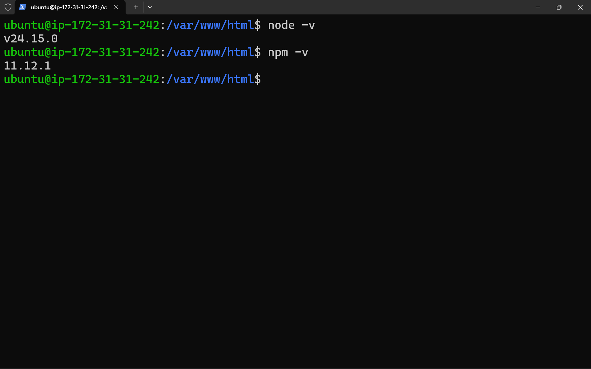
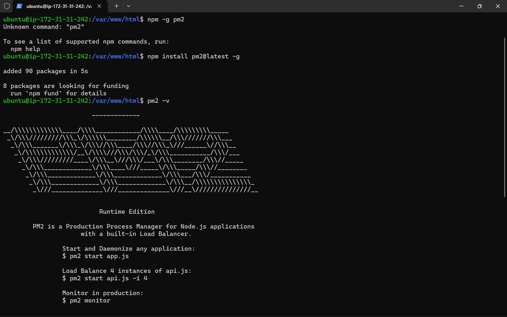
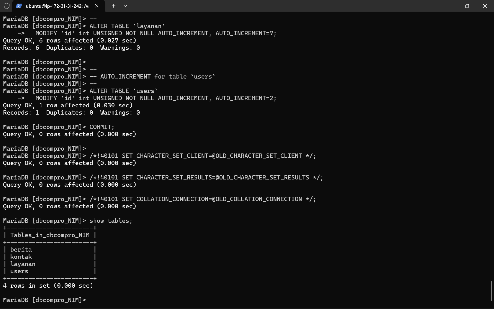
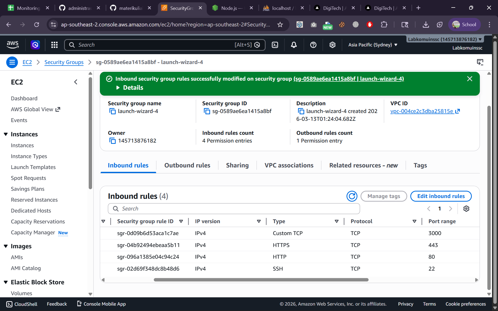
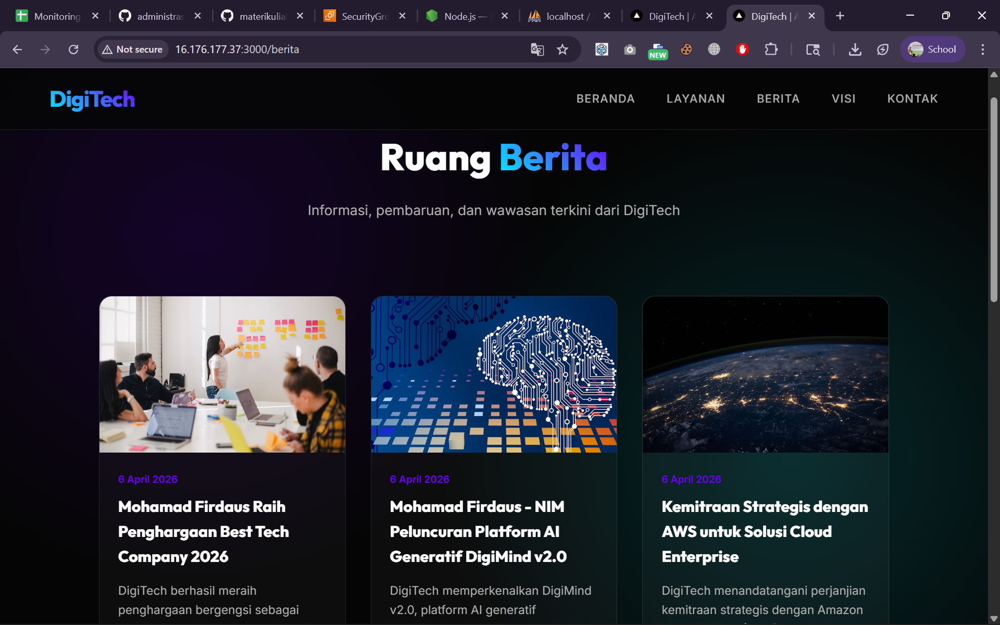

# MIgration Standalone Folder to Instance AWS Ec2

1. Upload standalone.zip via SFTP (Filezilla) 
2. Konek Open SSH -> ssh -i nama_file.pem ubuntu@[IP_ADDRESS] / PuTTY
 - Patching OS -> sudo apt update && sudo apt upgrade
3. Install tools unzip -> sudo apt install unzip -y 
4. cd /var/www/html
5. extract standalone.zip -> unzip standalone.zip
6. cek hasil Extract -> ls -R / dari filezilla 
7. Install Interpreter untuk Apps base node JS sesuai dokumentasi resmi
https://nodejs.org/en/download
  - curl -o- https://raw.githubusercontent.com/nvm-sh/nvm/v0.40.4/install.sh | bash
  - \. "$HOME/.nvm/nvm.sh"
  - nvm install 24
  - Verify the Node.js version:
    - node -v
  - Verify npm version:
    - npm -v 

 - Install PM2 untuk session state -> npm intall pm2@latest -g
 - pm2 -v

8. Export - Import DB 
    - Start DBMS (Laragon, xampp, dll)
    - Export db_compro
    - hapus ENGINE=InnoDB DEFAULT CHARSET=utf8mb4 COLLATE=utf8mb4_0900_ai_ci
    - Login usercompro
    - use dbcompro_NIM;
    - Copy Paste Query ctrl+A file sql export -> Klik Kanan di terminal AWS
    -show tables;

9. kita sesuaikan file .env
- cd standalone
- sudo nano .env
- sesuiakn isi .env : 
  DB_HOST=[IP_ADDRESS]
  DB_USER=usercompro_NIM
  DB_PASS=[PASSWORD]
  DB_NAME=dbcompro_NIM
 - ctrl+x -> y -> Enter 
10. pm2 start server.js
11. tambah / buka port 3000 di AWS Security Groups

12. Akses http://[IP_ADDRESS]:3000
13. akses BE http://[IP_ADDRESS]:3000/admin edit berita ke 2 tambahkan nama - nim
