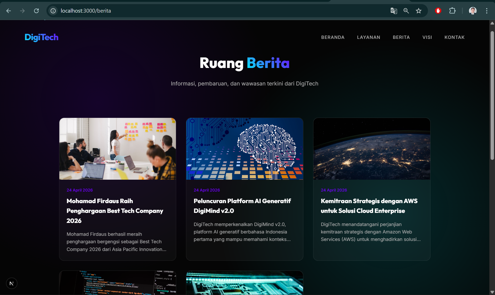

# Deploy Web Apps Framework Next.js ke AWS 

1. Pastikan Web Apps berjalan di Local
 - install dependensi -> npm install
 - create db dan import sql
 - create file .env dan isi sesuaikan dengan db local
 - jalankan web apps -> npm run dev
 - akses web apps di browser `http://localhost:3000`
 - Testing Front Pastikan tampilan muncul dan tanpa Error
 - testing Back end http://localhost:3000/admin
    username: admin
    password: admin123
 
 - Create static File -> npm run build
 - Archive folder standalone -> zip -> klik kanan folder standalone -> send to -> compressed (zipped) folder
