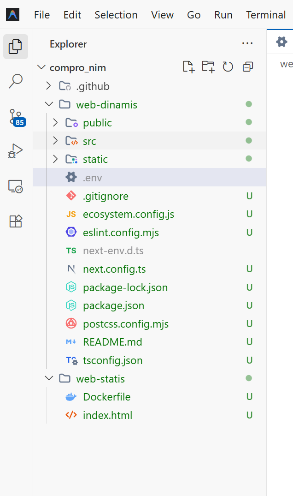
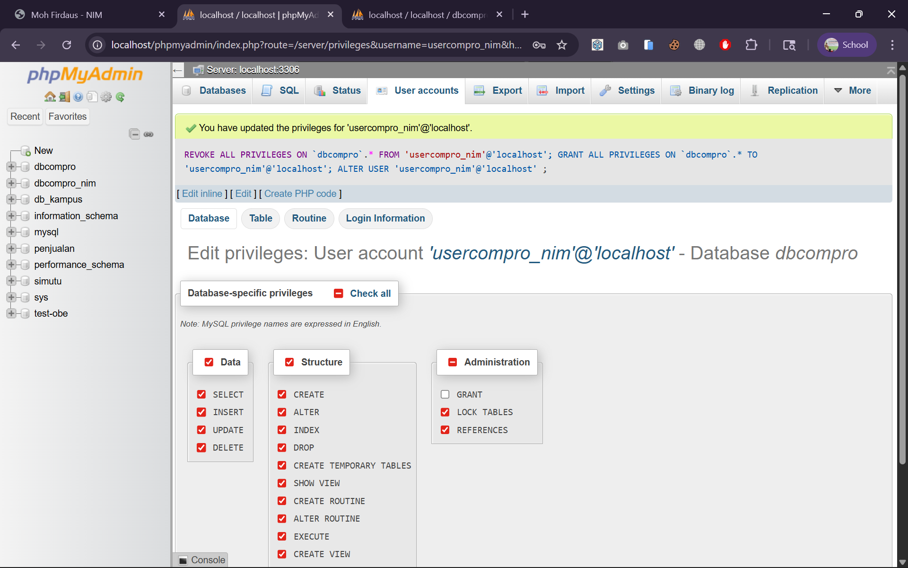
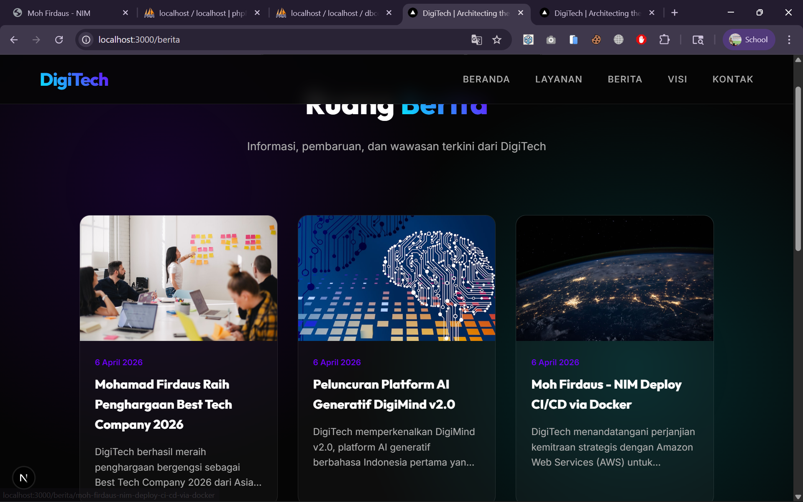

# Deploy Multi Apps CI/CD Docker 

1. Start Instance di AWS EC2
2. Patching OS -> sudo apt update && sudo apt upgrade
3. Hapus layanan nginx/apache dan uninstall -> sudo systemctl stop nginx && sudo systemctl disable nginx
   sudo apt remove nginx nginx-common nginx-core
   sudo apt remove apache2
4. Hapus layanan Mariadb dan uninstall -> sudo systemctl stop mariadb && sudo systemctl disable mariadb
   sudo apt remove mariadb-server mariadb-client mariadb-common
5. Testing Next.JS + db menggunakan user bukan root pada local environment
   - Copy Project Digitech pada ptmn6 kecuali folder .next, node_modules, sql kedalam folder web-dinamis
   
   - Create user baru bukan root di DBMS (Laragon, xampp, etc)
   
   - sesuaikan isi file .env
   - open terminal -> cd web-dinamis
   - npm i
   - npm run dev
   - Edit Berita ke-3 menjadi nama-nim
   