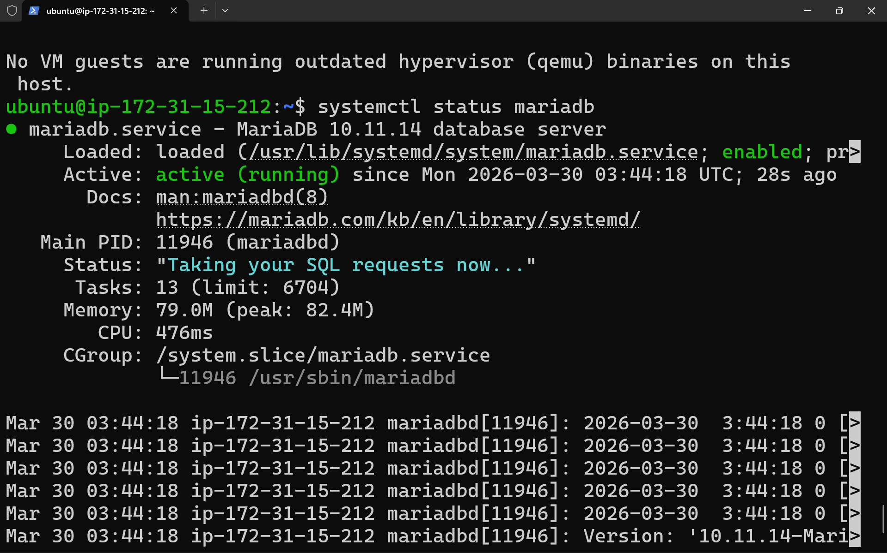
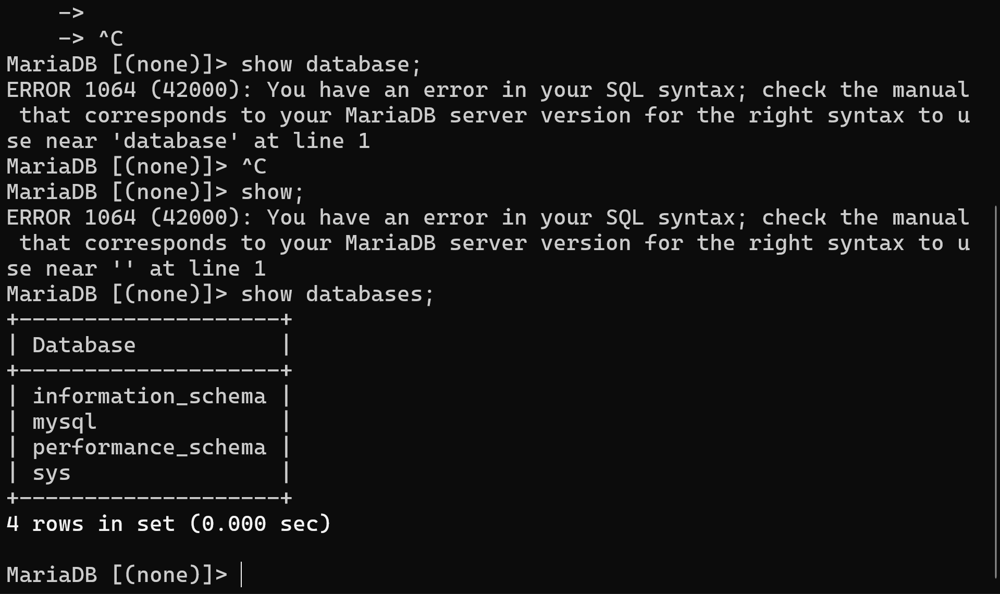
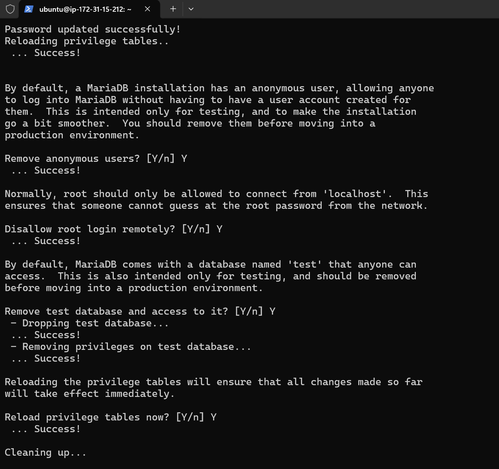
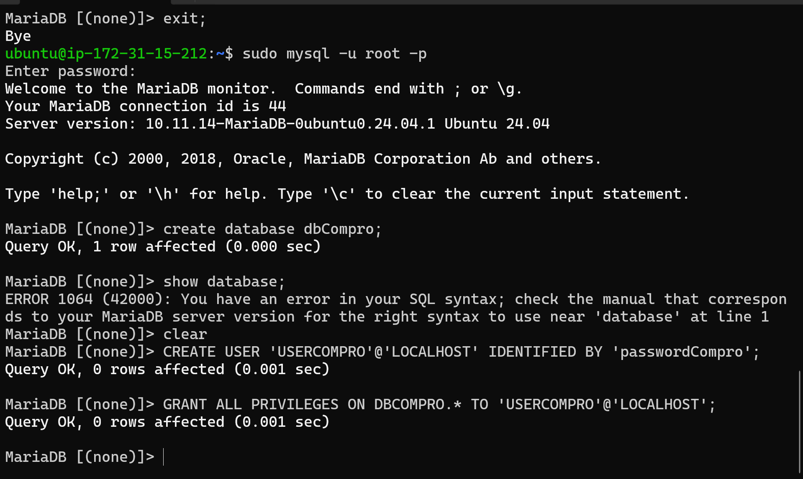
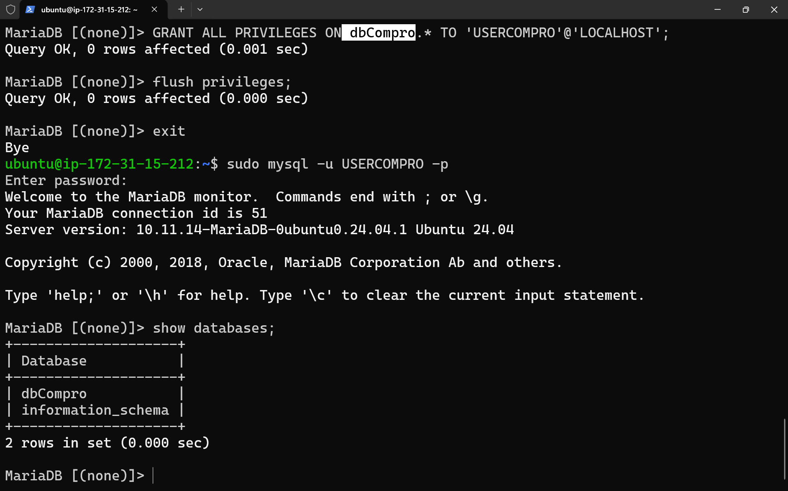

# Membuat Database MySQL di AWS EC2

1. Aktifkan Instance / VM di EC2
2. Remote SSH via Terminal
    - Masuk ke Folder penyimpanan Private Key AWS 
    - masukan command (ssh -i namafile.pem ubuntu@[IP_ADDRESS])
    - Tekan Enter
    - Keterangan open ssh hanya support di Windows 11
    - Jika menggunakan Windows 10 kebawah gunakan Putty
3. Lakukan Patching OS
    - sudo apt-get update && sudo apt-get upgrade

4. Kita akan install MariaDb
    - sudo apt-get install mariadb-server / mysql-server
    - sudo systemctl status mariadb
    - coba apakah default setting yg berlaku (sudo mysql -u root -p)
    - Cek apakah masih ada database dummy (show databases;)

5. Kita Lakukan Hardening Security
 - Masukan Command (sudo mysql_secure_installation)
 - masukan password kuat untuk user root
 - Remove anonymous users (Y)
 - Disallow root login remotely (Y)
 - Remove test database and access to it (Y)
 - Reload privilege tables now (Y)

6. Membuat database dan User 
 - Membuat database untuk Web Company Profile (create database dbcompro_nim;)
 - Membuat User untuk Web Company Profile (create user 'userCompro'@'localhost' identified by 'passwordCompro';)
 - Memberikan Hak Akses User untuk Web Company Profile (grant all privileges on dbcompro_nim.* to 'userCompro'@'localhost';)
 - Flush Privilege (flush privileges;)
 - Keluar dari MySQL (exit;)

7. Login sebagai user baru
 - Masukan Command (mysql -u userCompro -p)
 - Masukan Password
 - Cek apakah database dbcompro_nim sudah ada (show databases;)
 - use dbcompro_nim;

- Copy Paste Query SQL dari export dbcompro_nim di localhost