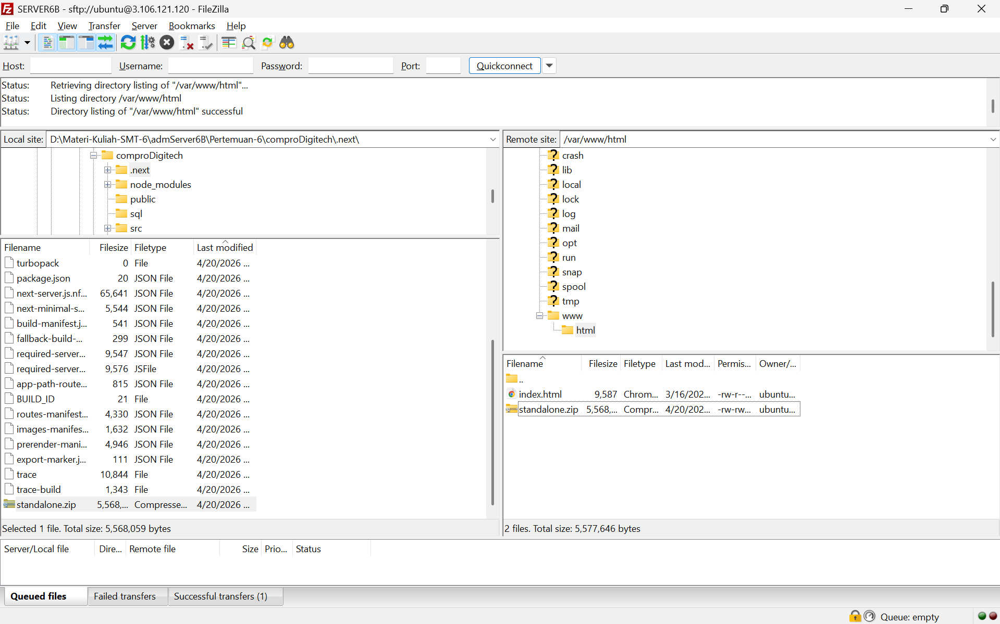
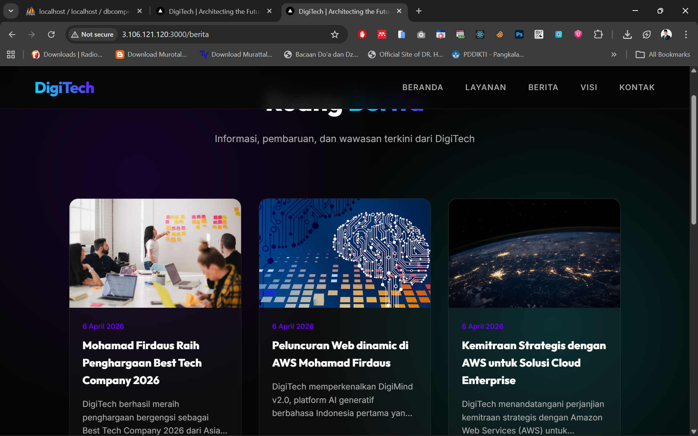

# Melakukan Uploading Web Apps Dynamic ke EC2 AWS

1. Pastikan Web Apps Dynamic sudah berjalan tanpa error di Localhost
2. Jika sudah tanpa Error kita akan membuat folder build
  - npm run build
  - Pastikan menghasilkan folder .next/standalone didalam tersedia folder Public dan di folder .next ada folder static

3. Proses Upload File Folder Standalone 
 - Lakukan Proses Archive pada folder .next/standalone dan folder Public .zip
 - Running Instance -> Connect Open SSH -> Connect Filezilla
 - Upload file hasil archive ke EC2 AWS menggunakan FileZilla

 - Ekstract file hasil archive di EC2 AWS
   1. Install tools Unzip di EC2 AWS
      - sudo apt install unzip -y
   2. Ekstract file hasil archive
      - unzip standalone.zip
4. Export dbcompro_nim dari Localhost import ke EC2 AWS
 - login ke SQL ec2 sudo mysql -u USERCOMPRO -p
 - use dbcompro_nim;
 - copy paste query SQL dari export dbcompro_nim di localhost
 - cek setiap tabel apakah sudah terisi
  - select * from berita;
  - select * from users;
  - select * from kontak;
  - select * from layanan;

5. Sesuaikan isi file .env di EC2 AWS
 - edit file .env
 - ctrs + s

6. di Terminal SSH cd ke folder standalone run apps
 - pm2 start server.js
 - pm2 save
 - pm2 startup

7. Buka Port 3000 di security group EC2 AWS
 - menu security
 - klik nama security group
 - edit inbound rules
 - add rule     
 - port 3000
 - save rule
8. Akses Web Compro dengan memasukan IP Public EC2 AWS dan Port 3000
 - http://[IP_ADDRESS]:3000
 - Akses Back End dengan memasukan IP Public EC2 AWS dan Port 3000
 - http://[IP_ADDRESS]:3000/admin
 - Login menggunakan user yang sudah ada di database
 - edit berita ke2 menjadi Peluncuran Web dinamis di AWS NAMA-MHS
